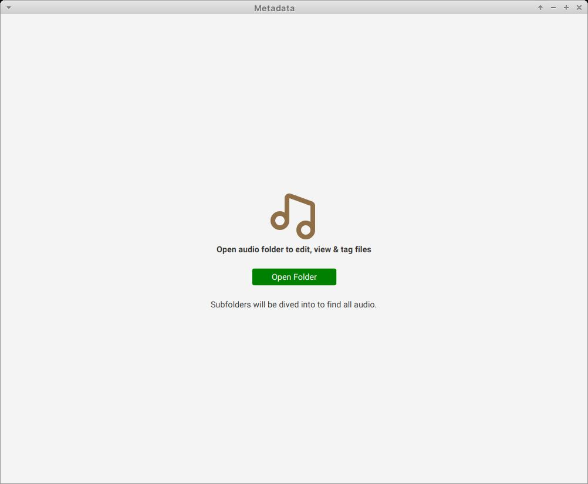
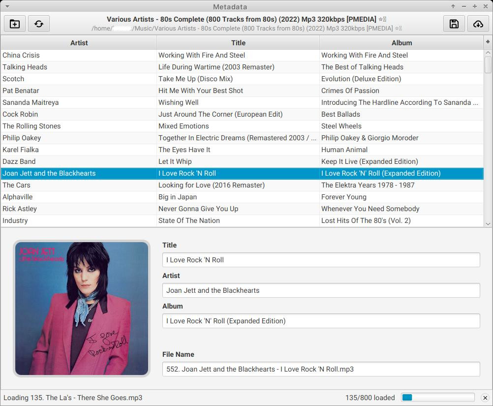
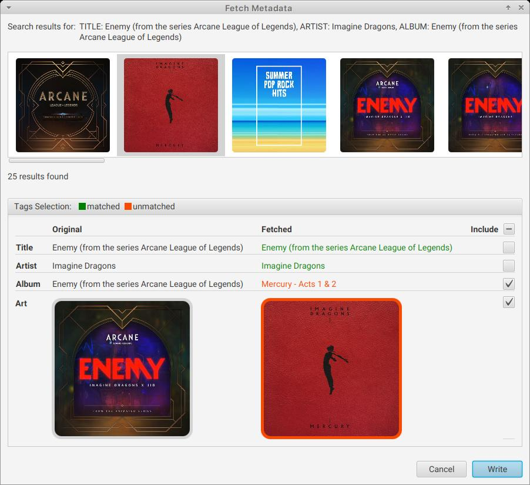

# MetaData - Tag Editor & Fetcher

**MetaData** simplifies managing your audio files' metadata. Easily edit tags and fetch them automatically from online databases.

### Supported Audio Formats

MP3, FLAC, Ogg Vorbis, MPA, M4A, M4P, AIF, WAV, WMA, DSF, Opus

### Key Features

- **Edit Tags:** Manually update artist, title, album, and cover art.
- **Automatic Tag Fetching:** Retrieve accurate tags from databases like [Deezer](https://www.deezer.com).
- **Review and Edit:** Ensure fetched tags match your preferences.
- **Seamless Workflow:** Intuitive interface for browsing, editing, and fetching tags with just two steps.

### Screenshots

#### Dive into your music library!

Open any folder and **MetaData** will automatically explore it and its subfolders for audio files, making it easy to manage your entire collection at once.

#### Files View & Editing

Review and edit tags for a specific song.

#### Search & Results
Search for tags based on song title and edit fetched tags.

### Getting Started

1. Download the latest release from the [Releases](https://github.com/IdelsTak/meta-data/releases) section.
2. Launch the application: `java -jar metadata-1.0.0.jar`.
3. **Explore Files:**
   - Click "**Open Folder**" to list audio files.
   - View or edit tags for your selected song.
   - Click "**Save**" to apply changes or "**Download**" to fetch tags online.
4. **Review and Edit:**
   - After downloading, select a result to compare fetched and existing tags.
   - Include or exclude fetched tags as needed.
5. **Save Changes:**
   - Click "**Write**" to apply the edited tags to your audio file.
