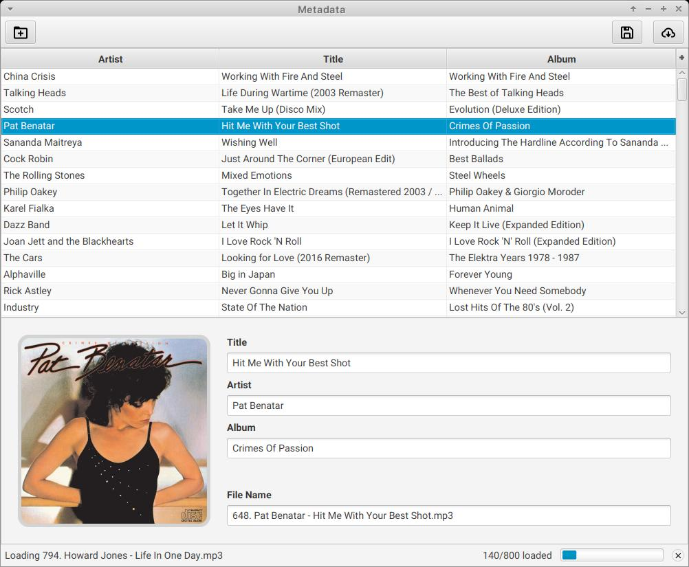

# MetaData - Tag Editor & Fetcher

I designed **MetaData** to manage the metadata (descriptive information) of your audio files.

It allows you to easily edit tags and fetch them automatically from online databases.

### Supported audio files

**Mp3**, **Flac**, **Ogg Vorbis**, **MPa audio**, **M4a**, **M4p audio**, **Aif**, **Wav**, **Wma**, **Dsf**, and **Opus**.

### Key Features:

 - **Edit audio file tags:** Manually edit information like artist, title, album, and even cover art.
 - **Automatic tag fetching:** Connect to online databases like [Deezer](https://www.deezer.com) to automatically retrieve accurate tags for your music files.
 - **Review and edit:** Review and edit fetched tags to ensure they match your preferences or specific needs.
 - **Seamless workflow:** The intuitive interface allows you to browse your music library, edit tags for a specific file, and easily initiate tag fetching. With only two steps for editing and writing tags, it can't get any simpler.

### Screenshots

The provided screenshots showcase the application's core functionalities:

**Files View & Editing:** This screenshot highlights the existing tags for a specific song. You can review details like track title, artist, album, and cover, and choose to keep or edit this information on your audio file.

 

**Search & Results:** This screenshot demonstrates searching for tags based on a song title. You can see the search query ("Enemy") and retrieved results (25 matches). The application allows you to edit the fetched tags. In this case, the original Album title, Mercury - Acts 1 & 2, is displayed as an unmatched tag. You can choose to include it or not.

 

### Getting Started:

 - Download the latest release of metadata from the [Releases](https://github.com/IdelsTak/meta-data/releases) section.
 - Install and launch the application.
 - **Explore files (as shown in Screenshot 1):**
    - Click the "Add Folder" button to the list all the audio files contained in that folder and its subfolders 
    - View or edit the title, artist, album, and/or cover art information for the song you want to update.
    - Click "Save" to apply the edited tags to your audio file.
    - The application will search online databases and display matching results.
 - **Review and Edit (as shown in Screenshot 2):**
    - Select the desired audio file from the list.
    - Review the fetched tags, including title, artist, album, and cover art
    - Include or leave out any fetched tags as it suits you.
 - **Save Changes:**
    - Click "Write" to apply the edited tags to your audio file.